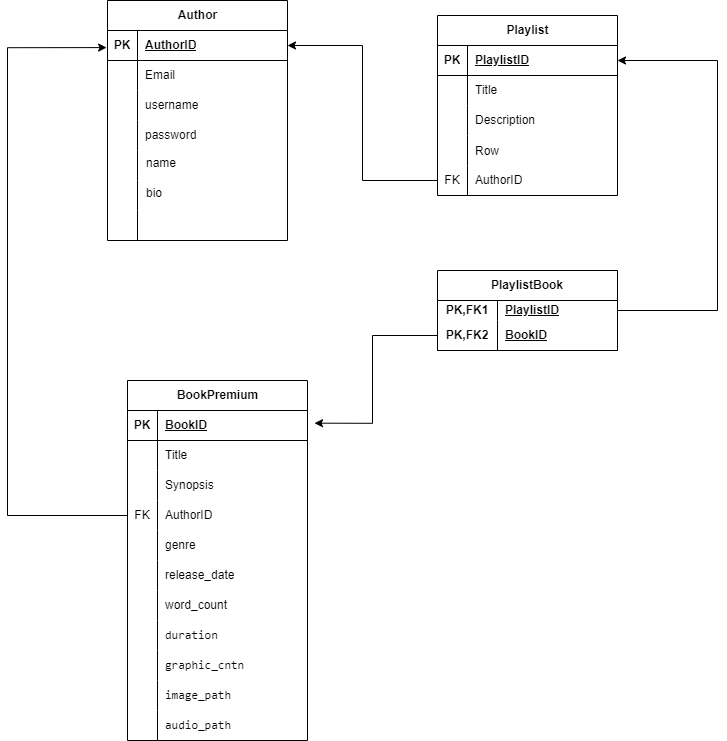

# Baca.a REST SERVICE

> Disusun untuk memenuhi Tugas Milestone 2 - IF3110 Pengembangan Aplikasi Berbasis Web

## Daftar Isi

- [Deskripsi](#deskripsi)
- [Skema Basis _Data_](#skema-basis-data)
- [Fungsional _Aplikasi_](#skema-basis-data)
- [Endpoint _API_](#endpoint-api)
- [Pembagian Tugas](#pembagian-tugas)
- [Anggota Kelompok](#anggota-kelompok)

## Deskripsi 
Baca.a REST SERVICE merupakan Web Service berbasis protokol REST yang menyediakan layanan untuk memakai Web Method yang dimiliki oleh Baca.a untuk pengguna premium.

## Skema Basis Data

Skema basis data yang digunakan adalah sebagai berikut

## Fungsional Aplikasi

1. CRUD Book Premium
2. CRUD Playlist
3. Fetch Data Author
4. Memanggil Web Method SOAP

## Endpoint API

http://localhost:8011/

## Pembagian Tugas
1. Setup docker, database : 13521095
2. CRUD Book Premium : 13521127
3. CRUD Playlist : 13521127
4. Memanggil Web Method SOAP : 13521095
5. Authentication Author : 13521095

## Angota Kelompok

1. Muhamad Aji Wibisono: 13521095
2. Shelma Salsabila: 13521115
3. Marcel Ryan Antony : 13521127
